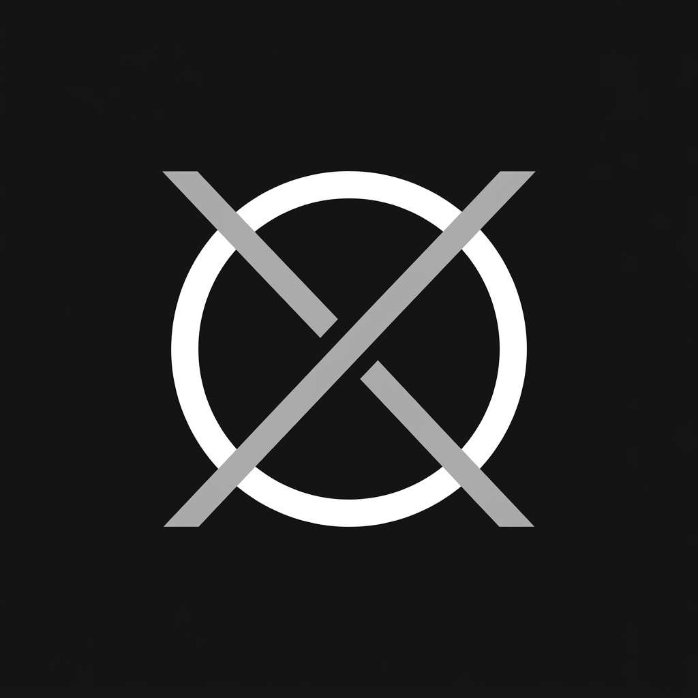
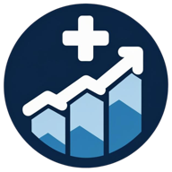
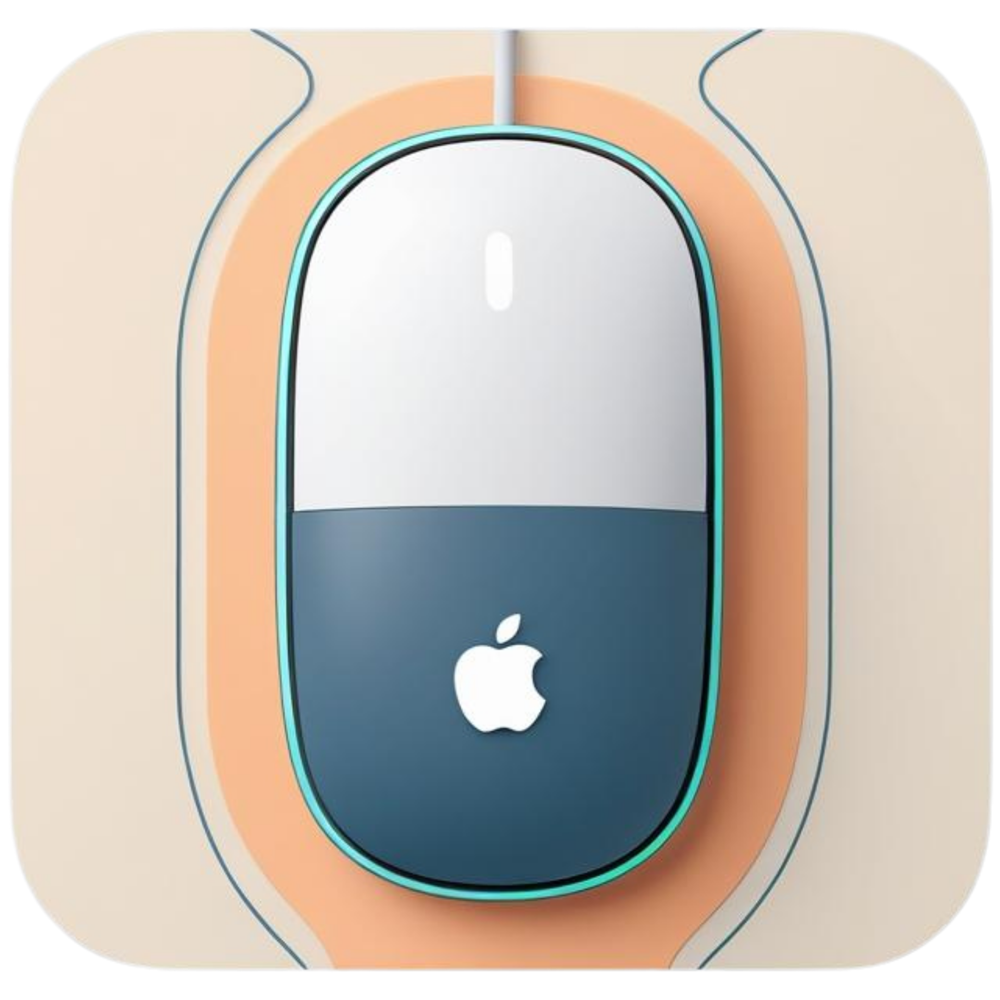

<h1 align="center">ZEESHAN AHMAD</h1>

  <b>Principal Software Engineer &amp; AI Architect</b>

  

  
  
  

  
  
  
  

---

###  Professional Overview

I am an engineering leader with **10+ years of experience** building high-performance enterprise applications, now designing and building stateful multi-agent workflows, MCP-powered agent runtimes, LLM evaluation pipelines, and context-optimization layers.

---

###  Featured Architecture

<table border="0" width="100%">
<tr>
<td width="50%" valign="top">
<h4> <a href="https://github.com/zeeshan1112/zerowebtools">ZeroWebTools</a></h4>

Privacy-first browser utility suite of 55+ developer, PDF, and image tools running 100% client-side via WebAssembly. Engineered with a modular TypeScript core library shared across the web app and a Chrome Extension.

  
  
  

</td>
<td width="50%" valign="top">
<h4> <a href="#">DocScale (Private)</a></h4>

Healthcare B2B SaaS platform that automates clinic site provisioning in seconds. Architected with React/Vite dashboards, Next.js App Router for server-side rendering (SSR), and PostgreSQL Row Level Security (RLS) for tenant isolation.

  
  
  

</td>
</tr>
<tr>
<td width="50%" valign="top">
<h4> <a href="https://github.com/zeeshan1112/KeepMacAwake">KeepMacAwake</a></h4>

Native macOS menu-bar utility preventing system sleep by posting synthetic user activity events directly into the CoreGraphics HID queue (bypassing macOS sleep policies without visible cursor movement).

  
  
  

</td>
<td width="50%" valign="top">
<h4> <a href="https://github.com/zeeshanahmad-io/zeeshanahmad-dev-showcase">Zeeshan Ahmad Dev Showcase</a></h4>

Professional developer portfolio and technical blog built using React/Vite and Keystatic CMS, featuring hybrid Markdown storage and reader mode layout configurations.

  
  
  

</td>
</tr>
</table>

---

###  Technical Ecosystem

| category | tools & technologies |
| :--- | :--- |
| **AI / LLM** | LangGraph, Model Context Protocol (MCP), Prompt Engineering, LLM Evaluation (Benchmarking Harnesses), NLP |
| **Languages** | Python, TypeScript, Java, Node.js, JavaScript (ES6+), T-SQL |
| **Frameworks** | Next.js, React, Spring Boot, Supabase, Lucene, Express, Docker, Tailwind CSS |
| **Editors** | Cursor, Claude Code, GitHub Copilot, Antigravity Codex |

---

###  Global Impact & Metrics

  

---

<i>"For you to do something new, you need to stop doing something old."</i>

